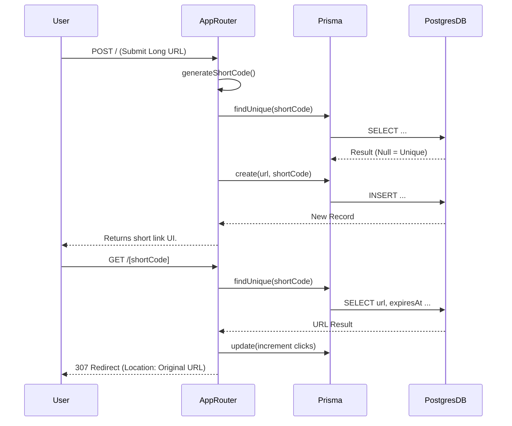

# Technical Deep Dive: Surl (URL Shortener)

This document provides a comprehensive architectural and technical analysis of the **Surl** URL shortener repository. It examines the backend logic, data models, potential concurrency issues, and a roadmap for scaling the system to production.

---

## 1. High-Level Purpose

**Surl** is a lightning-fast, production-ready URL shortener designed to take long URLs and convert them into manageable, shareable short links. 

**User Workflow:**
1. A user visits the landing page and pastes a long URL.
2. The user submits the form, which triggers a server action.
3. The server generates a unique 6-character short code, saves the mapping to the database, and returns the shortened link.
4. When anyone visits `/[shortCode]`, the application looks up the original URL.
5. If valid and not expired, the system increments the click counter and redirects the user to the original destination.

**Core Features:**
- Custom shortened URLs generation.
- Click analytics tracking (counters).
- 7-day expiration policy for created links.
- Recent links dashboard (Top 10 most recent links).

---

## 2. Complete Tech Stack Overview

The application adopts a modern, full-stack Next.js architecture seamlessly unified within a single repository.

- **Framework**: **Next.js 16.1.6 (App Router)**
  - *Reasoning*: The App router provides built-in API routing, server actions for form mutations without explicit API boilerplate, and excellent support for Server-Side Rendering (SSR) and Edge performance.
- **UI & Styling**: **React 19.2.3, Tailwind CSS v4, Lucide React, Framer Motion, Sonner**
  - *Reasoning*: Used to build beautiful, responsive, and interactive UIs rapidly. Framer Motion handles micro-animations, while Sonner manages toast notifications.
- **Database ORM**: **Prisma 6.19.2**
  - *Reasoning*: A highly-typed Node.js ORM that integrates seamlessly with TypeScript. Provides automated migrations, robust query building, and type safety straight from the schema.
- **Database**: **PostgreSQL**
  - *Reasoning*: A powerful, open-source relational database. Ideal for ACID compliance, enforcing unique constraints on the `shortCode`, and atomic operations (like click incrementing).

**Trade-offs**:
- *Using Server Actions over traditional REST APIs*: While it accelerates development and reduces boilerplate, it tightly couples the frontend code with backend operations. 
- *Postgres vs. NoSQL*: Postgres ensures consistency and handles unique constraints automatically. However, horizontal scaling at enormous volumes requires connection pooling (e.g., PgBouncer) and read-replicas compared to easier horizontal scaling in NoSQL like Cassandra.

---

## 3. Full Folder & File Structure Explanation

```text
src/
├── app/
│   ├── [code]/
│   │   └── route.ts         # Dynamic Route Handler: Performs the DB lookup and 307/308 redirect.
│   ├── actions/
│   │   └── link.ts          # Server Actions: createShortLink and getRecentLinks. Core DB mutations logic.
│   ├── api/links/
│   │   └── route.ts         # API Route: Returns JSON list of recent links.
│   ├── layout.tsx           # Provides HTML document structure and global styles.
│   └── page.tsx             # Main Landing Page containing the hero section and UI components.
├── components/
│   ├── CreateLinkForm.tsx   # Client component for URL submission (calls createShortLink).
│   └── RecentLinks.tsx      # Renders the recent links dashboard.
├── lib/
│   ├── prisma.ts            # Global Prisma Client singleton initialization to prevent connection leaks.
│   └── utils.ts             # Helper functions: URL validation, short-code generation, Tailwind string patching.
prisma/
└── schema.prisma            # Database schema definition for the `Link` model.
```

**Interaction Flow:**
1. `page.tsx` renders `CreateLinkForm.tsx`.
2. Form submission invokes the `createShortLink` function in `actions/link.ts`.
3. `actions/link.ts` relies on `util.ts` for generation and `prisma.ts` for data persistence.
4. When a user navigates to `/[code]`, the `route.ts` inside the `[code]` directory processes the incoming request and performs the redirect.

---

## 4. Backend Logic Deep Dive

### Short Code Generation & Collision Handling
The URL generator (`utils.ts`) creates a 6-character string using a `Math.random()` index lookup among `[A-Za-z0-9]`. 

**Retry Logic (Collision Resolution)** inside `actions/link.ts`:
1. Loop runs up to 5 times.
2. In each iteration, it generates a short code format (`generateShortCode()`).
3. Queries Prisma: `prisma.link.findUnique({ where: { shortCode } })`.
4. If it returns null, marking `isUnique = true` and breaking out of the loop.
5. If after 5 tries no unique code is found, returns an error. This is a naive collision resolution technique that works perfectly in early-to-mid stages but requires optimization for extreme scale.

### Redirection & Dynamic Routes (`[code]/route.ts`)
When a GET request targets `/[code]`:
1. Destructures the Promise-wrapped `params` to extract the short code.
2. Uses Prisma to query the database using the unique constraint `shortCode`.
3. Validates link existence and expiration threshold (`expiresAt < new Date()`).
4. Updates click analytics eagerly: `prisma.link.update({ data: { clicks: { increment: 1 } } })`.
5. Executes `next/navigation`'s `redirect(urlToRedirect)` helper.

### Sequence Diagram


---

## 5. Database Schema and Design

**Prisma Schema:**
```prisma
model Link {
  id        String    @id @default(cuid())
  url       String
  shortCode String    @unique
  createdAt DateTime  @default(now())
  expiresAt DateTime?
  clicks    Int       @default(0)
}
```

**Analysis & Implications**:
- **Primary Key (`id`)**: Uses `cuid()` which prevents predictability and avoids integer exhaustion.
- **`shortCode @unique`**: Enforces a database-level B-Tree index on `shortCode`. This enables fast `O(log n)` lookups globally when processing a redirect, making resolution highly performant.
- **Clicks**: Integer column initialized to 0. It serves essentially as a simple transactional counter.
- **Constraints**: PostgreSQL strictly upholds the unique constraint. If the 5-loop retry fails concurrently at the transaction commit phase, Postgres prevents data corruption.

---

## 6. API Design & Contracts

The standard API layer relies heavily on Next.js Server Actions, but traditional REST approaches exist.

### 1. Create Link (Server Action `createShortLink`)
- **Action**: Form submission.
- **Input**: FormData containing `url` (String).
- **Validation**: Strict client-side validation, server-side `isValidUrl()` validation returning early if false.
- **Outputs**: 
  - Success: `{ success: true, link: { ...LinkObject } }`
  - Error: `{ error: "String Message" }`
  
### 2. Redirect Endpoint (`GET /[code]`)
- **Input**: `code` URL path parameter.
- **Operation**: Find link, validate expiration, increment click.
- **Output**: 
  - **Success**: `307 Temporary Redirect` (handled by Next.js `redirect`).
  - **Error (404 Not Found)**: If the short link does not exist in DB.
  - **Error (410 Gone)**: If `expiresAt` > current server time.
  - **Error (500 Internal Error)**: DB unavailability.

### 3. Fetch Recent Links (`GET /api/links`)
- **Input**: None
- **Output**: `200 OK` with JSON `{ "links": [ ...LinkObject ] }`

---

## 7. Concurrency, Race Conditions & Correctness

1. **Short Code Collision Race Condition**:
   - Two users submit *different* URLs simultaneously. The `Math.random()` code generation creates the *same* shortcode `X1A9m` for both on two different incoming processes.
   - Both processes evaluate `findUnique` and return `null`.
   - Both proceed to `create` simultaneously. PostgreSQL unique constraint (`@unique`) acts as the ultimate arbiter: one succeeds, and one crashes with `P2002 Unique constraint failed`.
   - *Mitigation strategy*: Right now, it crashes the failed request. A database `try/catch` wrapping the `create` action within a while-loop (Optimistic Concurrency Control) would prevent 500s completely.
2. **Click Counter Updates**:
   - Handled flawlessly via Atomic Operations: `prisma.link.update({ data: { clicks: { increment: 1 } } })`.
   - Instead of reading the click count, adding 1, and saving (which risks read-modify-write lost updates), Prisma transpiles this to `UPDATE Link SET clicks = clicks + 1` in SQL natively, guaranteeing atomic correctness.

---

## 8. Scalability & Production Roadmap

Currently, hitting the DB per redirect causes high direct DB load. As scale grows, phased updates are mandatory.

### Phase 1: Caching Layer Injection (Redis)
- **Bottleneck**: Hitting PostgreSQL for every redirect introduces IO latency.
- **Mitigation**: Introduce Upstash / Redis. Before polling Prisma on `GET /[code]`, check cache `get(code)`. 
  - Cache miss -> DB lookup -> `set(code, url)`.
  - Cache hit -> redirect instantly.
  
### Phase 2: Asynchronous Click Analytics
- **Bottleneck**: Updating the Database inline synchronously before returning a redirect creates huge latency for the user.
- **Mitigation**: Use Redis or a Message Queue (RabbitMQ / Kafka / SQS). 
  - Drop a click event `{ code, timestamp }` to the queue.
  - Return the redirect immediately. 
  - A background worker flushes the queue to Postgres `clicks` in batches of 1000 dynamically.

### Phase 3: Global CDN / Edge Execution
- **Strategy**: Move `[code]/route.ts` to Vercel Edge Runtime or Cloudflare Workers. Coupled with Edge Redis, this globally delegates redirection caching close to users out of serverless regions, plunging P99 latency.

---

## 9. Security, Abuse & Edge Cases

- **Input Validation:** Enforced stringently in `utils.isValidUrl`. It denies malformed protocols (only `http`/`https` allowed), stopping `javascript:alert(1)` XSS redirection attacks.
- **SQL Injection Prevention:** Prisma ORM automatically uses parameterized SQL queries. Variable interpolation is completely handled at the engine level, leaving no room for injected statements.
- **DoS & Brute-Force Rate Limiting (Missing):** The application currently allows infinite link generation spanning. An attacker can write a script creating thousands of URLs/sec, bloating the database table.
  - *Fix:* Must implement IP-based Rate Limiting (e.g., via Upstash Rate Limit in Edge middleware, capping to 10 redirects/min per IP).

---

## 10. Performance Metrics & Benchmarking Suggestions

**Testing Tooling**: Use **k6** or **Artillery** to emulate high concurrent usage.

**Recommended Test Plan**:
1. **Load Test**: Generate 10 URLs. Hit those 10 URLs using 500 Virtual Users over 5 minutes.
2. **Write Spike Test**: Spam the `createShortLink` endpoint explicitly to view PostgreSQL CPU spikes.
3. **Key Metrics to Track**:
   - **P95 / P99 Latency (Redirects):** Should maintain < 50ms total response time locally, < 100ms via public internet.
   - **Throughput / QPS:** How many requests Next.js handles before CPU throttling affects Node.js the single thread.

---

## 11. Strengths & Weaknesses

**Strengths**:
- Exceptionally clean, modern codebase utilizing bleeding-edge framework features (Next.js 16/React 19).
- Atomic incrementing built correctly for analytical counters.
- Great implementation of unique DB constraints to protect mapping intelligence.

**Weaknesses**:
- Synchronous pathing on redirect (User has to wait for a database UPDATE event to finish before receiving their 307 redirect payload).
- Naive loop generation resolution on Server Action: Database race conditions during `create` aren't gracefully caught to trigger an automated retry loop; instead, they might just 500 error if concurrent checks hit perfectly.
- Complete lack of Rate Limiting exposes the `/actions` to malicious bloating.

---

## 12. Implementation Roadmap

### **Next Steps & Code Adjustments:**
1. **Add Rate Limiting (Urgent)**:
   - Install `@upstash/ratelimit` and `@upstash/redis`.
   - Implement Next.js `middleware.ts` to restrict the `/` (creation) interface to 5 insertions per minute per IP.
2. **Move to Edge Computing & Caching (High Priority)**:
   - Alter `/[code]/route.ts` to `export const runtime = "edge"`.
   - Setup Upstash Redis inside the route. Perform cache lookups `await redis.get(code)`. 
3. **Decouple Analytics from Redirect Flow (Medium Priority)**:
   - Within `/[code]/route.ts`, avoid the blocking `await prisma.update(...)`. Use `waitUntil()` in the Next.js execution context to spin the DB update to a background promise while returning the redirect instantly to the client.
4. **Enhanced Collision Architecture**:
   - Wrap the `prisma.link.create()` inside a `try/catch` within a `while` loop that identifies Prisma Error Code `P2002` (Unique Constraint), retrying transparently rather than relying on the read-first `findUnique` which inherently causes race conditions.
